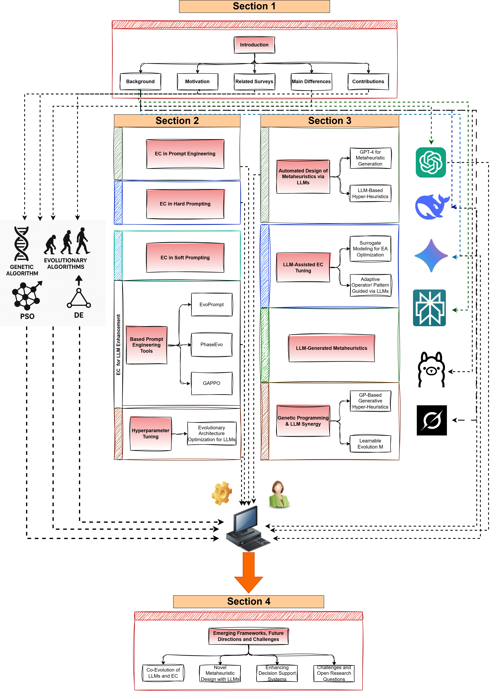

# 🧠 Evolutionary Computation and Large Language Models

Welcome to the companion site for the survey:

**[Evolutionary Computation and Large Language Models: A Survey of Methods, Synergies, and Applications](https://arxiv.org/abs/2505.15741)**  
*Authors: Dikshit Chauhan, Bapi Dutta, Indu Bala, Niki van Stein, Thomas Bäck, Anupam Yadav*  

## 📘 Abstract

We present a systematic survey of how **LLMs** and **Evolutionary Computation (EC)** can mutually benefit from each other through synergy. The paper covers prompt engineering, architecture search, hyperparameter tuning, and automated metaheuristic generation.

## 🧭 Taxonomy Diagram



## 📂 Repository Highlights

- ✅ Paper on [arXiv](https://arxiv.org/abs/2505.15741)
- 🔍 Read our [README](./README.md) for details
- 📄 View the [citation](#citation)

## 📚 Citation

```bibtex
@misc{chauhan2025evolutionarycomputationlargelanguage,
      title={Evolutionary Computation and Large Language Models: A Survey of Methods, Synergies, and Applications}, 
      author={Dikshit Chauhan and Bapi Dutta and Indu Bala and Niki van Stein and Thomas Bäck and Anupam Yadav},
      year={2025},
      eprint={2505.15741},
      archivePrefix={arXiv},
      primaryClass={cs.NE},
      url={https://arxiv.org/abs/2505.15741}, 
}

